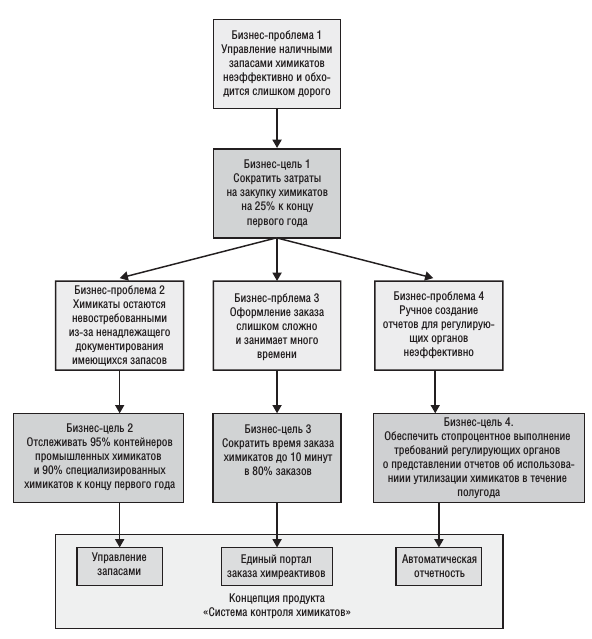
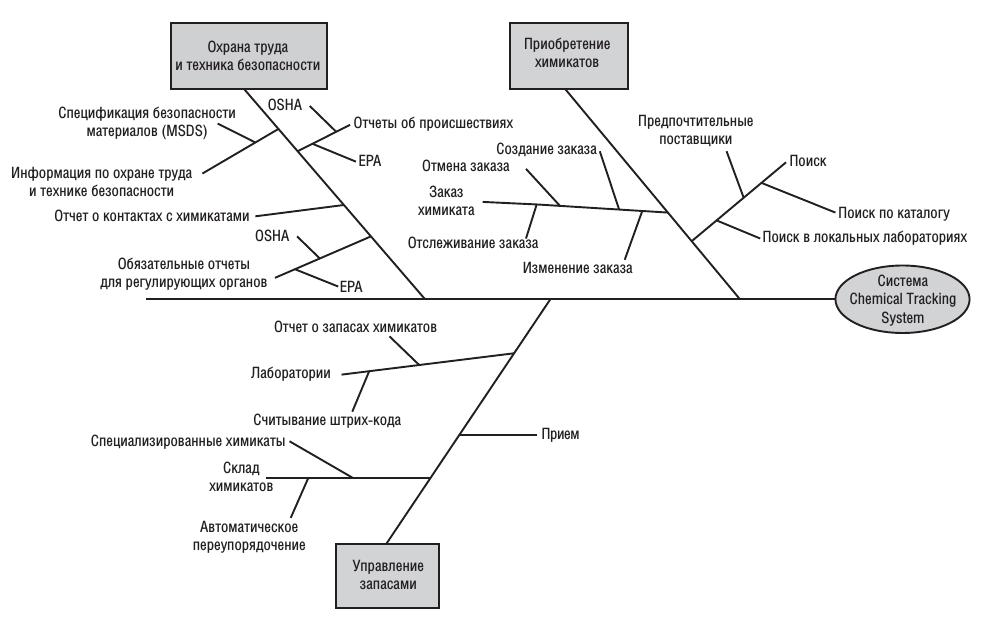

# Документ о концепции и границах #

## 1. Бизнес требования ##


### 1.1 Исходные данные ###

```
Они суммируют обоснование и содержание нового продукта или изменения,
которые нужно внести в существующий продукт. Здесь помещают общее
описание предыстории или ситуации, в результате чего было принято реше-
ние о создании продукта.

```

### 1.2 Возможности бизнеса ###

```
Для корпоративной информационной системы описывают бизнес-задачу,
которая решается посредством этого продукта, или бизнес-процессы, для
улучшения которых требуется продукт, а также среду, в которой система бу-
дет использоваться. Для коммерческого продукта описывают существующие
рыночные возможности и рынок, на котором продукту придется конкури-
ровать с другими продуктами. Этот раздел может содержать сравнительную
оценку существующих продуктов и возможных решений, указывая, в чем
заключается привлекательность продукта и его преимущества. Опишите за-
дачи, которые не удается разрешить без предлагаемого решения. Покажите,
насколько оно соответствует тенденциям рынка, развитию технологий или
корпоративной стратегии. Кратко опишите другие технологии, процессы
или ресурсы, необходимые для удовлетворения клиента.

Опишите потребности типичных клиентов или целевого рынка. Предста-
вьте задачи клиента, которые будет решать новый продукт. Предоставьте
примеры того, как клиенты будут использовать продукт. Укажите все извест-
ные критичные требования к качеству или интерфейсам, но не упоминайте
особенности реализации и дизайна.
```

### 1.3 Бизнес-цели ###

```
Суммирует важные преимущества бизнеса, предоставляемые продуктом, в
количественном и измеряемом виде. Банальности («стать компанией миро-
вого класса») и нечетко сформулированные улучшения («обеспечить высо-
кий уровень сервиса для клиентов») нельзя считать ни полезными, ни под-
дающимися проверке.

Пример финансовых целей:

- Освоить X% рынка за Y месяцев
- Увеличить долю рынка в стране W с X% до Y% за Z месяцев
- Достигнуть объема продаж X единиц или дохода в Y долларов за Z месяцев

Пример нефинансовых целей:

- Достигнуть показателя удовлетворения покупателей, равного по крайней мере X, 
  в течение Y месяцев со времени выпуска продукта
- Увеличить производительность обработки транзакций на X% и снизить уровень ошибок
  данных до величины не более Y%
- Разработать надежную платформу для семейства связанных продуктов
- Разработать специальную базовую технологическую основу для организации

Имея набор бизнес-целей, задайтесь вопросом: «Что мешает нам до-
стичь этот ориентир?», чтобы определить более подробную бизнес-задачу.
Или можно вернуться назад, задав вопрос: «Почему нам вообще важен этот
ориентир?», чтобы лучше понять бизнес-задачу или возможность верхнего
уровня. При наличии бизнес-задачи спросите себя: «Как определить, что
задача решена?», чтобы определить измеряемую цель. Процесс выполняет-
ся итеративно путем передвижения по иерархии задач и целей, пока не по-
лучится список функций, которые позволят решить задачи для достижения
целей.
```

### 1.4 Критерии успеха ###

```
Определите, как заинтересованные лица будут определять и измерять успех
проекта. Установите факторы, которые максимально влияют
на успех проекта — те, которые организация может контролировать, и те, ко-
торые находятся вне сферы ее влияния.
```

Пример модели бизнес-целей:



### 1.5 Положение о концепции ###

```
Составьте сжатое положение о концепции проекта, обобщающее долгосрочные
цели и назначение нового продукта. В этом документе следует отразить сба-
лансированную концепцию, удовлетворяющую различных заинтересованных
лиц. Она может быть несколько идеалистичной, но должна основываться на
существующих или предполагаемых рыночных факторах, архитектуре пред-
приятия, стратегическом направлении развития корпорации или ограниче-
ниях ресурсов. Далее показан шаблон, состоящий из ключевых слов, которые
прекрасно подходят для документа о концепции продукта (Moore, 1991):

• Для [целевая аудитория покупателей];
• Который [положение о потребностях или возможностях];
• Эта (этот) [имя продукта];
• Является [категория продукта];
• Который(ая) [основные функции, ключевое преимущество, основная
причина для покупки или использования];
• В отличие от [основной конкурирующий продукт, текущая система или
текущий бизнес-процесс];
• Наш продукт [положение об основном отличии и преимуществе нового
продукта].

Вот как выглядит положение о концепции системы контроля химикатов
Chemical Tracking System в Contoso Pharmaceuticals:

Для ученых, которым нужно запрашивать контейнеры с химика-
том, данная система Chemical Tracking System является информаци-
онной системой, которая обеспечит единую точку доступа к складу
химикатов и к поставщикам. Система будет знать местоположение
каждого контейнера с химикатом в компании, количество химиката
в контейнерах и полную историю перемещения и использования каж-
дого контейнера. Эта система сэкономит компании 25% затрат на
химикаты в первый год работы, позволив полностью использовать уже
полученные химикаты, утилизировать меньшее количество частично
израсходованных или просроченных химикатов и применять единую
стандартную систему приобретения химикатов. В отличие от дей-
ствующих сейчас ручных механизмов заказов химикатов наш продукт
будет генерировать все отчеты, необходимые для регулирующих орга-
нов, в которых требуются сведения об использовании, хранении и ути-
лизации химикатов.
```

### 1.6 Бизнес-риски ###

```
Обобщает важнейшие бизнес-риски, связанные с разработкой — или не с раз-
работкой — этого продукта. В категорию рисков входят рыночная конкурен-
ция, временные факторы, приемлемость для пользователей, проблемы, свя-
занные с реализацией, и возможные негативные факторы, влияющие на биз-
нес. Бизнес-риски отличаются от рисков проекта, которые обычно связаны
с доступностью ресурсов и особенностями технологий. Оцените возможные
потери от каждого фактора риска, вероятность его возникновения, вашу спо-
собность контролировать его, а также определите все возможные действия по
смягчению ситуации.
```

### 1.7 Предположения и зависимости ###

```
Предположение (assumption) — это утверждение, которое предполагается вер-
ным в отсутствие знаний или доказательств иного. Бизнес-предположения
тесно связаны с бизнес-требованиями. Неверные предположения могут не
позволить достичь поставленных бизнес-целей. Например, куратор из руко-
водства компании может поставить бизнес-цель увеличить доход на 100 тыс.
долларов в месяц. Определяя такую цифру, куратор сделал определенные
предположения, например что новый сайт будет привлекать 200 дополни-
тельных уникальных посетителей в день и что каждый посетитель в среднем
будет тратить 17 долларов. Если новый сайт не привлечет достаточно посе-
тителей, тратящих достаточное количество денег, проект может не достичь
своей бизнес-цели. Если окажется, что те или иные предположения не оправ-
дались, можете изменить границы или график проекта или запустить другие
проекты, чтобы достичь другие цели.

Задокументируйте все предположения, сделанные заинтересованными
лицами, когда они обдумывали проект и создавали данный документ о кон-
цепции и границах. Часто предположения одних лиц не разделяют другие
стороны. Если вы запишите их и просмотрите позже, то избежите возможной
путаницы и ухудшения ситуации в будущем.

Задокументируйте важнейшие зависимости проекта от внешних факто-
ров — изменения отраслевых стандартов или предписаний регулирующих ор-
ганов, других проектов, сторонних поставщиков или партнеров по разработке.
Предположения и зависимости бизнеса могут превратиться в риски, которые
должен регулярно отслеживать менеджер проекта. Нарушение зависимостей —
популярная причина задержек проекта. Опишите возможные последствия
того, что предположения окажутся ошибочными или зависимости нарушены,
чтобы заинтересованные лица могли понять, почему это так важно.
```

## 2. Рамки и ограничения проекта ##

```
Когда химик изобретает новую химическую реакцию, которая преобразует
одно вещество в другое, он пишет документ, в который входит раздел «Рамки
и ограничения», где описывает, что получится и не получится в результате
этой реакции. Точно так же для проекта по разработке ПО следует опреде-
лить его рамки и ограничения. Вам необходимо указать, что может делать
система, а что не может.
Многие проекты страдают «распуханием границ» — резким ростом из-за
активного расширения функциональности продукта. Первый шаг на пути
к обузданию распухания границ — определение рамок проекта. Границы
проекта определяют концепцию и круг действия предложенного решения.
В ограничениях указываются определенные возможности, которые не будут
включены в продукт. Рамки и ограничения помогают установить реалистич-
ные ожидания заинтересованных лиц, потому что иногда клиенты запраши-
вают функции, слишком дорогостоящие или выходящие за предполагаемые
границы продукта.
```

### 2.1 Основные функции ###

```
Опишите основные функции продукта или возможности пользователей, уде-
лив основное внимание тому, что отличает продукт от предыдущей версии
или конкурирующих продуктов. Подумайте, как пользователи будут рабо-
тать с этими функциями, чтобы убедиться, что список функций полон и не
содержит ненужных функций, которые интересны, но не приносят пользы
пользователям. Назначьте каждой функции уникальное и постоянное на-
звание, чтобы ее можно было отслеживать в других компонентах системы.
Можно создать древовидную схему вида:
```



### 2.2 Объем первоначально запланированной версии ###

```
Обобщает основные запланированные функции, включенные в первона-
чальную версию продукта. Границы проекта обычно определяются как на-
бор функций, но их можно также определять в терминах пользовательских
историй, вариантов использования, потоков вариантов использования или
внешних событий. Также можно описать характеристики качества, которые
позволят продукту предоставлять предполагаемые преимущества различным
классам пользователей.
```

### 2.3 Объем последующих версии ###

```
Если вы ожидаете поэтапную эволюцию продукта или если используете ите-
ративную модель разработки, создайте план выпуска, в котором укажите, ка-
кие функции будут отложены и желательные сроки последующих выпусков.
В последующих версиях вы сможете реализовать дополнительные варианты
использования и функции и расширить возможности первоначальных ва-
риантов использования и функций. Чем дальше вы заглядываете, тем более
расплывчатыми будут границы проекта. Вам наверняка придется передви-
нуть функциональность с одного запланированного выпуска до другого и,
возможно, добавлять незапланированные функции. Короткие циклы выпу-
сков часто предоставляют удобные случаи для накопления знаний, основан-
ных на отзывах клиентов.

В некоторых случаях бывает удобно объединять пункты "Объем первоначально 
запланированной версии" и "Объем последующих версий" в единую таблицу. Пример:
```

| Функции                             | Выпуск 1                                                                                                       | Выпуск 2                                             | Выпуск 3                                             |
|-------------------------------------|----------------------------------------------------------------------------------------------------------------|------------------------------------------------------|------------------------------------------------------|
| FE-1. Заказ в кафетерии             | Только стандартные функции из менюобедов; оплата заказов производится только посредством удержания из зарплаты | Прием платежа кредитной или дебетовой картой         | Прием заказов на завтрак и ужин                      |
| FE-2. Заказы из ресторанов          | Не реализована                                                                                                 | Блюда доставляются только на территории компании     | Реализована полностью                                |
| FE-3. Подписки на стандартные блюда | Не реализована                                                                                                 | Реализация, если позволит время                      | Реализована полностью                                |
| FE-4. Меню                          | Создание и просмотр меню                                                                                       | Модификация, удаление и архивирование меню           |                                                      |
| FE-5. Список ингредиентов           | Не реализована                                                                                                 | Реализована полностью                                |                                                      |
| FE-6. Доступ к системе              | Интрасеть и доступ через Интернет извне                                                                        | Приложения для телефонов и планшетов с iOS и Android | Приложения для телефонов и планшетов с Windows Phone |

### 2.4 Ограничения и исключения ###

```
Перечислите все возможности или характеристики, которых могут ожидать
заинтересованные в проекте лица, но включение которых в продукт или в
определенную версию не запланировано. Перечислите изъятые элементы,
чтобы не забыть решения по границам проекта. Если пользователь запросил
возможность доступа к системе с телефона, когда он не находится на рабочем
месте, и эта функция была признанной не входящей в границы проекта, тогда
четко запишите в соответствующем разделе: «Новая система не поддержива-
ет доступа с мобильных устройств».
```

## 3. Бизнес-контекст ##

```
В этом разделе представлены профили основных категорий заинтересован-
ных лиц, приоритеты руководства в проекте, а также сводка некоторых обсто-
ятельств, которые надо учесть при планировании развертывания решения.
```

### 3.1 Профили заинтересованных лиц ###

```
Заинтересованными в проекте лицами (stakeholders) называются отдельные
лица, группы или организации, которые активно вовлечены в проект, на кото-
рых влияет результат проекта и которые сами могут влиять на этот результат.
Профили заинтересованных лиц описывают различные категории клиентов и 
других ключевых лиц, заинтересованных в этом проекте. Вам не нужно 
описывать каждую группу заинтере сованных лиц, например юристов, которые 
должны проверять соответствие надлежащим законам. Сферой вашего интереса 
должны стать различные группы клиентов, целевые рыночные сегменты и 
различные классы пользователей, входящих в эти сегменты. В профиль каждого
 заинтересованного в проекте лица включается следующая информация:

*  основная ценность или преимущество, которое продукт принесет заин-
    тересованным лицам, и то, как продукт удовлетворит покупателей. Цен-
    ность для заинтересованных лиц представляют:
    - повышенная производительность;
    - меньшее количество переделок;
    - снижение себестоимости;
    - ускорение бизнес-процессов;
    - автоматизация задач, ранее выполнявшихся вручную;
    - возможность выполнять совершенно новые задачи;
    - соответствие соответствующим стандартам и правилам;
    - лучшая, по сравнению с текущими продуктами, легкость и простота ис-
    пользования;
*   их вероятное отношение к продукту;
*   самые важные для них функции и характеристики;
*   все известные ограничения, которые должны быть соблюдены.

Можно включить поименный список ключевых заинтересованных лиц
  для каждого профиля или структурную схему организации, показывающую
  отношения между заинтересованными лицами в организации.
  
Пример профиля заинтересованных лиц (ПО заказа блюд):
```

| Заинтересованное лицо        | Основная ценность                                                                                           | Отношение                                                                                                                           | Основные интересы                                                                             | Ограничения                                                                                                           |
|------------------------------|-------------------------------------------------------------------------------------------------------------|-------------------------------------------------------------------------------------------------------------------------------------|-----------------------------------------------------------------------------------------------|-----------------------------------------------------------------------------------------------------------------------|
| Руководство компании         | Увеличение производительности труда сотрудников; сокращение затрат в кафетерии                              | Сильная поддержка вплоть до выпуска 2; поддержка выпуска 3, в зависимости от результатов предыдущих выпусков                        | Экономия расходов должна превысить затраты на разработку и использование                      | Не определены                                                                                                         |
| Сотрудники кафетерия         | Более эффективное использование рабочего времени сотрудников в течение дня; большее удовлетворение клиентов | Озабоченность взаимоотношениями с профсоюзом и возможным сокращением персонала; в остальном — все воспринимается нормально          | Сохранение рабочих мест                                                                       | Необходимость обучения сотрудников работе с Интернетом; необходимость в персонале и транспорте для доставки           |
| Постоянные клиенты кафетерия | Лучший выбор блюд; экономия времени; удобство                                                               | Большой энтузиазм, но могут использовать систему меньше, чем ожидается, из-за социальной значимости обедов в кафетерии и ресторанах | Простота использования; надежность доставки; возможность выбора блюд                          | Необходимость доступа к корпоративной интрасети, к Интернету или требуется мобильное устройство                       |
| Отдел расчета зарплаты       | Отсутствие какой-либо выгоды; необходимость создания схемы удержания стоимости заказов из зарплаты          | Не особо счастливы относительно предстоящей работы над ПО, но понимают ценность для компании и сотрудников                          | Минимум изменений в текущих приложениях расчета зарплаты                                      | Еще не выделено никаких ресурсов на изменение ПО                                                                      |
| Менеджеры ресторанов         | Увеличение продаж; выходна новые области рынка для привлечения новых клиентов                               | Увеличение продаж; выход на новые области рынка для привлечения новых клиентов                                                      | Минимум новых технологий; озабоченность ресурсами и затратами, необходимыми для доставки блюд | Могут не иметь персонала и возможностей для обработки нужных объемов заказов; не у всех меню представлены в Интернете |


### 3.2 Приоритеты проекта ###

```
Чтобы принимать эффективные решения, заинтересованные лица должны
договориться о приоритетах проекта. Один из подходов к этому заключается
в рассмотрении пяти измерений: функции (или объем), качество, график, за-
траты и кадры. В любом проекте каждое из этих измерений
относится к одной из трех категорий:

* ограничение — сдерживающий фактор, в рамках которого должен опери-
ровать менеджер проекта;
* ведущий фактор — важный фактор успеха, ограниченно гибкий при из-
менениях;
* степень свободы — возможность для менеджера проекта до определен-
ной степени менять измерение и балансировать относительно других из-
мерений.
```

### 3.3 Особенности развертывания ###

```
Перечислите информацию и действия, необходимые для обеспечения эф-
фективного развертывания решения в рабочую среду. Опишите доступ, ко-
торый потребуется пользователями для работы с системой, в частности, на-
ходятся ли они далеко в разных часовых поясах или недалеко друг от друга.
Укажите, когда пользователям в разных местах нужен доступ к системе. Если
требуются изменения инфраструктуры, чтобы обеспечить потребности ПО в
мощностях, доступе к сети, хранилищу данных и миграции данных, опишите
эти изменения. Зафиксируйте всю информацию, которая потребуется тем,
кто будет готовить бизнес-процессы обучения и модификации в связи с раз-
вертыванием нового решения.

Пример:

ПО веб-сервера нужно обновить до последней версии. В рамках второго вы-
пуска нужно разработать приложения для смартфорнов и планшетов под
управлением iOS и Android, а в третьем выпуске нужно выпустить приложе-
ния для смартфонов и планшетов с Windows Phone. К моменту готовности
второго выпуска все соответствующие изменения должны быть выполнены.
Нужно разработать видеоролики длительностью не более пяти минут, обу-
чающие пользователей работе с интернет-версией и приложениями системы
Cafeteria Ordering System.
```
